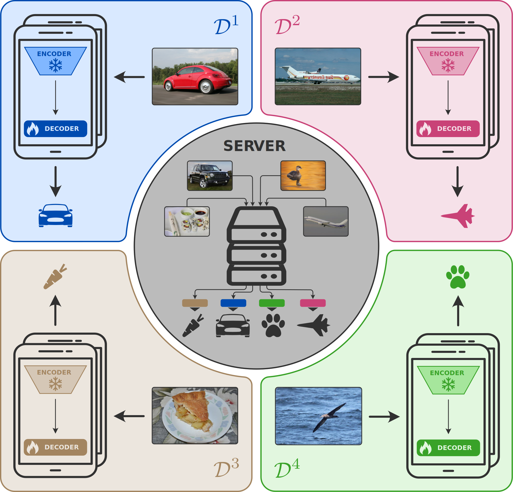

# FedPromo

Federated Learning (FL) is an established paradigm for training deep learning models on decentralized data. However, as the size of the models grows, conventional FL approaches often require significant computational resources on client devices, which may not be feasible. 
We introduce FedPromo, a novel framework that enables efficient adaptation of large-scale foundation models stored on a central server to new domains encountered only by remote clients. 
Instead of directly training the large model on client devices, FedPromo optimizes lightweight proxy models via FL, significantly reducing computational overhead while maintaining privacy.
Our method follows a two-stage process: first, server-side knowledge distillation aligns the representations of a large-scale foundation model (e.g., a transformer) with those of a compact counterpart (e.g., a CNN). Then, the compact model encoder is deployed to client devices, where  trainable classifiers are learned locally. These classifiers are subsequently aggregated and seamlessly transferred back to the foundation model, facilitating personalized adaptation without requiring direct access to user data.
Through novel regularization strategies, our framework enables decentralized multi-domain learning, balancing performance, privacy, and resource efficiency. 
Extensive experiments on five image classification benchmarks demonstrate that FedPromo outperforms existing methods while assuming limited-resource clients.

## 📊 Graphical Abstract

<div align="center">



</div>

## ⚠️ Repository Notice

This repository is associated with our academic paper currently under peer review. It is being made temporarily available in connection with the corresponding [arXiv preprint](https://arxiv.org/abs/XXXXXXXX) to allow readers and reviewers to reference the project.

At this stage, **the repository does not yet contain the full source code**. The codebase is undergoing final preparations and will be released **shortly after acceptance** of the manuscript to the target venue. Our goal is to ensure full reproducibility and ease of use for the community upon release.

## 📌 Stay Informed

If you are interested in FedPromo and would like to be notified when the code is released:

- Watch this repository using the GitHub "Watch" feature
- Star the repository to bookmark it for later

We appreciate your interest and your patience.

## 📄 Citation

If you wish to cite this work, please refer to the following BibTeX entry (temporary, subject to update upon publication):

```bibtex
@article{caligiuri2025fedpromo,
  title={FedPromo: Federated Lightweight Proxy Models At The Edge Bring New Domains To Foundation Models},
  author={Caligiuri, Matteo and Others},
  journal={arXiv preprint arXiv:XXXXXXXX},
  year={2025}
}
