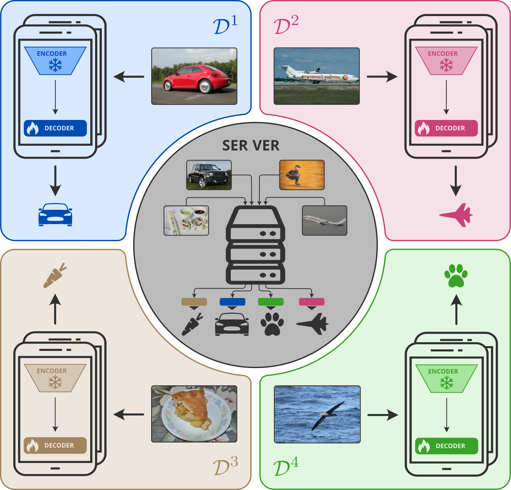

# FedPromo

## Federated Lightweight Proxy Models At The Edge Bring New Domains To Foundation Models

[](https://www.python.org/downloads/)
[](https://pytorch.org/)
[](https://flower.dev/)
[](LICENSE)
[](https://arxiv.org/abs/2508.03356)

**TL;DR**: FedPromo enables efficient adaptation of large foundation models to new domains via federated learning of lightweight proxy models on edge devices, transferring their knowledge back to the foundation model without accessing user data.

## 👥 Authors

<div align="center">

| [Matteo Caligiuri](https://matteocali.github.io/) | [Francesco Barbato](https://medialab.dei.unipd.it/members/francesco-barbato/) | [Donald Shenaj](https://donaldssh.github.io/) | [Umberto Michieli](https://umbertomichieli.github.io/) | [Pietro Zanuttigh](https://medialab.dei.unipd.it/members/pietro-zanuttigh/) |
|:---:|:---:|:---:|:---:|:---:|

**Department of Information Engineering, University of Padova**,
Via Gradenigo 6/b, 35131 Padova, Italy


</div>

## 📊 Graphical Abstract

<div align="center">



</div>

## 📑 Citation

If you use this code in your research, please cite our paper:

```bibtex
@article{caligiuri2026fedpromo,
  title={FedPromo: Federated Lightweight Proxy Models At The Edge for Fine-Grained Image Classification with Foundation Models},
  author={Caligiuri, Matteo and Barbato, Francesco and Shenaj, Donald and Michieli, Umberto and Zanuttigh, Pietro},
  journal={IEEE Internet of Things Journal},
  year={2026},
  publisher={IEEE}
}
```

## 🌟 Key Features

### 🚀 Core Contributions

- **Cross-Architecture Federated Knowledge Transfer (CA-FKT)**: Novel paradigm enabling federated learning across heterogeneous model architectures (foundation models ↔ lightweight proxies)
- **FedPromo Framework**: Scalable solution for training large-scale foundation models through federated lightweight proxy models on edge devices
- **Cross-Architectural Knowledge Distillation**: Seamless integration of knowledge transfer with federated optimization, bridging the gap between different model architectures
- **Privacy-Preserving Model Adaptation**: State-of-the-art performance across 5 image classification benchmarks while maintaining strict privacy guarantees

### 🔧 Technical Features

- **Lightweight Proxy Models**: Efficient adaptation through small edge-deployable proxies (MobileNetV3) that learn from foundation models (DINOv2)
- **Bidirectional Knowledge Transfer**: Foundation models provide initial knowledge to proxies, proxies transfer learned domain knowledge back to foundation models
- **FedPromo Algorithm**: Novel combination of ICP (Inactive Classes Preservation) clients and FedAvg strategy with our enhancements
- **Edge-Compatible Design**: Optimized for resource-constrained devices while maintaining high performance
- **Enhanced Personalization**: Addresses client heterogeneity through specialized aggregation and consistency mechanisms
- **Superior Generalization**: Cross-domain knowledge transfer improves model performance on unseen domains

### 📊 Comprehensive Evaluation

- **Multi-Domain Benchmarks**: Validated across 5 image classification datasets (CompCars, UECFOOD256, NABirds, MilitaryAircraft, StanfordDogs)
- **Privacy-Preserving**: No raw data sharing, only encrypted model updates with optional differential privacy
- **Scalable Architecture**: Supports 100+ clients with efficient communication protocols
- **Research-Ready**: MLflow integration, comprehensive logging, and visualization tools

### 🛠️ Implementation Features

- **Multiple FL Algorithms**: Support for FedAvg, FedProx, MOON, FedAlign, alongside our novel FedPromo approach
- **Flexible Model Support**: Easy integration of new foundation models and proxy architectures
- **Differential Privacy**: Built-in DP support for enhanced privacy protection with configurable privacy budgets
- **Hydra Configuration**: Modular configuration system for easy experimentation and hyperparameter tuning
- **Comprehensive Monitoring**: Real-time training metrics, convergence analysis, and client behavior visualization

## 🏗️ Architecture Overview

FedPromo follows a novel three-phase architecture that enables foundation models to learn new domains through federated proxy models:

1. **Pretraining Phase**: Knowledge distillation from foundation models to lightweight proxy models
2. **Federated Learning Phase**: Distributed training of proxy models across edge devices using FedPromo algorithm
3. **Knowledge Transfer Phase**: Transferring learned knowledge back to the foundation model

```text
FedPromo/
├── main.py                    # Main entry point
├── ckpt_and_embeddings_dw.py  # Download pre-computed checkpoints/embeddings
├── conf/                      # Configuration files
│   ├── base.yaml              # Base configuration
│   ├── federated/             # FL-specific configs
│   │   ├── client_type/       # Client algorithms (ICP, FedProx, MOON, etc.)
│   │   ├── strategy/          # Server strategy (FedAvg)
│   │   ├── dts/               # Dataset configurations
│   │   └── partitioner/       # Data partitioning strategies
│   └── pretraining/           # Pretraining configurations
├── modules/                   # Core implementation
│   ├── models/                # Model architectures (DINOv2, MobileNetV3)
│   ├── federated/             # FL components (FedPromo implementation)
│   ├── datasets/              # Data handling and partitioning
│   ├── trainers/              # Training logic
│   └── common/                # Utilities and helper functions
├── extras/                    # Auxiliary assets and standalone scripts
│   ├── scripts/               # create_embeddings.py, multi_domain_eval.py, statistical_analysis.py
│   ├── results/               # Precomputed results used by statistical_analysis.py
│   └── images/                # Graphical abstract and other figures
├── data/                      # Data and checkpoints
└── outputs/                   # Experiment results and logs
```

## 🚀 Quick Start

### 1. Environment Setup

```bash
# Clone the repository
git clone https://github.com/LTTM/FedPromo.git
cd FedPromo

# Create conda environment - choose the appropriate file for your system:
# - env_linux_cuda.yml: Linux with CUDA support (recommended for GPU training)
# - env_win_cuda.yml: Windows with CUDA support
# - env_cpu.yml: CPU-only environment (any OS, slower training)
conda env create -f ./extras/<your_arch_of_choice>.yml
conda activate fedpromo

# Verify installation
python -c "import torch; print(f'PyTorch: {torch.__version__}')"
python -c "import flwr; print(f'Flower: {flwr.__version__}')"
```

### 2. Data Preparation

```bash
# Set your data directory in conf/base.yaml
# IMPORTANT: The trailing slash (/) is essential and cannot be removed!
# All datasets will be located in a 'datasets' folder inside this path
# Example: if dts_root_dir: /home/user/data/, datasets will be in /home/user/data/datasets/
dts_root_dir: /path/to/your/data/

# Most datasets will be automatically downloaded if not found in the datasets folder
# For supported datasets (CompCars, Stanford Cars, CUB-200, NABirds, etc.)
# the framework will handle download and setup automatically
```

### 3. Pre-computed Embeddings and Checkpoints (Optional)

For faster DINOv2 evaluation and knowledge distillation, you can optionally download pre-computed embeddings and checkpoints to reproduce the exact paper results using the provided download script:

```bash
# Use the dedicated download script to get embeddings and checkpoints
python ckpt_and_embeddings_dw.py

# Interactive mode: The script will guide you through download options
# You can choose to download:
# - All embeddings and checkpoints
# - Only embeddings (for faster evaluation)
# - Only checkpoints (to reproduce paper results)
# - Specific datasets or model combinations

# Non-interactive mode with arguments:

# List all available files without downloading
python ckpt_and_embeddings_dw.py --list-files

# Download everything (all checkpoints + embeddings)
python ckpt_and_embeddings_dw.py --everything

# Download only DINOv2 embeddings (speeds up evaluation and knowledge distillation)
python ckpt_and_embeddings_dw.py --embeddings

# Download only pre-training checkpoints (teacher model weights from knowledge distillation)
python ckpt_and_embeddings_dw.py --pretrain

# Download only federated learning checkpoints (trained proxy models from FL experiments)
python ckpt_and_embeddings_dw.py --federated

# Download all checkpoints (both pre-training and federated)
python ckpt_and_embeddings_dw.py --all-checkpoints

# Files will be automatically placed in:
# - data/embeddings/: Pre-computed DINOv2 embeddings
# - data/checkpoints/: Pre-trained model checkpoints
```

#### Alternative: Create Custom Embeddings

If you prefer not to download pre-computed embeddings or need to create embeddings for new datasets, you can generate them locally using the provided script:

```bash
# Create embeddings for your datasets
python extras/scripts/create_embeddings.py

# Note: This script has no command-line arguments or CLI options
# All configuration must be set up in the constants at the beginning of the file
# Edit the script to specify:
# - Target datasets
# - Model configurations
# - Output paths
# - Embedding parameters

# This is optional - the code will work without pre-computed embeddings but will be slower
# during evaluation and knowledge distillation phases
```

### 4. Basic Usage

#### Pretraining Only

```bash
python main.py \
    pretrain_dts=stanfordcars \
    pretraining_epochs=60 \
    pretraining_batch_size=64 \
    server_model=dinov2_vit_large14_reg \
    client_model=mobilenetv3_small \
    classifier=single \
    skip_fed=True \
    pretraining_checkpoint=None
```

#### Federated Learning Only

```bash
python main.py \
    server_model=dinov2_vit_large14_reg \
    client_model=mobilenetv3_small \
    classifier=single \
    skip_pretraining=True \
    federated/dts=compcars \
    federated/client_type=icp \
    federated/strategy=fedavg \
    num_clients=100 \
    num_rounds=500
```

### 5. Individual Model Testing

It is also possible to test individual models as standalone entities by running their model definition scripts directly. This allows for independent evaluation and debugging of foundation models and proxy models without the federated learning pipeline.

```bash
# Test DINOv2 foundation model directly
# Uses conf/dinov2.yaml configuration
python modules/models/dinov2_vit_small14_reg.py

# Test MobileNetV3 proxy model directly
# Uses conf/mobilenetv3.yaml configuration
python modules/models/mobilenetv3_small.py
```

For more information about individual model configurations and testing options, see the corresponding model scripts in `modules/models/` and their configuration files in `conf/`.

## 📊 Supported Models

### Foundation Models (Teachers)

- **DINOv2**: `dinov2_vit_small14_reg`, `dinov2_vit_base14_reg`, `dinov2_vit_large14_reg`
- **CLIP**: Support for various CLIP variants
- **Custom Architectures**: Easily extensible for new models

### Client Models (Students)

- **MobileNetV3**: `mobilenetv3_small`, `mobilenetv3_large`
- **Custom Architectures**: Easily extensible for new models

## 🔧 Federated Learning Algorithms

### Client Types

- **ICP**: Inactive Classes Preservation (Our method)
- **Base**: Standard FedAvg client
- **FedProx**: Proximal regularization for client drift
- **MOON**: Model contrastive learning
- **EMA**: Exponential Moving Average client

### Server Strategies

- **FedAvg**: Standard federated averaging (Our method uses FedAvg)

> [!NOTE]
> **FedPromo = ICP (client) + FedAvg (server)** - This combination forms our complete federated learning algorithm for foundation model adaptation.

## 📂 Datasets & Features

### Supported Datasets

- **Computer Vision**:
    - Stanford Cars -> CompCars
    - Food101 -> UECFOOD256
    - CUB-200 -> NABirds
    - FGVC Aircraft -> Military Aircraft
    - ImageNetPets -> Oxford Pets
- **Custom Datasets**: Easy integration through two approaches:

  #### Method 1: Using Existing PyTorch Datasets

  Create configuration files in `conf/federated/dts/` or `conf/pretraining/dts/` following the existing examples. Any PyTorch dataset can be used by defining the correct configuration.

  #### Method 2: Custom Dataset Implementation

  1. Implement a custom dataset class inheriting from appropriate base classes
  2. Make it discoverable using the `@add_dts` decorator:

    ```python
    from modules.common.decorators import add_dts

    @add_dts
    class MyCustomDataset(ImageFolder, DefDataset):
        # Your custom dataset implementation
    ```

  3. Create the corresponding configuration file in `conf/federated/dts/` or `conf/pretraining/dts/`

  See examples in `modules/datasets/compcars_handler.py` and existing config files for reference.

### Data Partitioning

- **Dirichlet Distribution**: Non-IID data simulation
- **Custom Partitioners**: Implement your own partitioning strategies following the [Flower Framework documentation](https://flower.dev/docs/framework/how-to-use-partitioners.html) for data partitioning

## 🔒 Privacy Features

### Differential Privacy

- **Client-side DP**: Local differential privacy with gradient clipping and gaussian noise
- **Server-side DP**: Central DP with adaptive clipping

For more details on differential privacy implementations, see the [Flower Framework documentation](https://flower.dev/docs/framework/how-to-use-differential-privacy.html) and the foundational paper:

> Abadi, M.; Chu, A.; Goodfellow, I.; McMahan, H. B.; Mironov, I.; Talwar, K.; and Zhang, L. 2016. Deep learning with differential privacy. In Proceedings of the 2016 ACM SIGSAC conference on computer and communications security, 308–318.


## 📋 Configuration

The framework uses Hydra for configuration management. Key configuration files:

- `conf/base.yaml`: Main configuration
- `conf/federated/`: FL-specific configurations
- `conf/pretraining/`: Pretraining configurations

## 📊 Evaluation and Visualization

### Multi-Domain Evaluation

````bash
python extras/scripts/multi_domain_eval.py
````

The multi-domain evaluation demonstrates one of FedPromo's key capabilities: **seamless domain integration**. After federated training across different domains, the domain-specific decoders learned by proxy models can be concatenated together on the server and attached to the Oracle (foundation model) encoder. This allows the foundation model to recognize classes from all domains simultaneously with negligible performance loss, enabling true multi-domain knowledge transfer without requiring access to data from multiple domains during training.

### Partition Visualization

````bash
python main.py plot_label_distribution=True
````

This generates visualizations showing how data is distributed across federated clients, helping analyze the heterogeneity and non-IID characteristics of your federated setup.

## 🔬 Extending FedPromo with Custom Algorithms

Since FedPromo is built on the [Flower Framework](https://flower.dev/), it provides extensive flexibility for implementing and testing different federated learning algorithms. You can create custom client algorithms and server strategies by following the comprehensive [Flower documentation](https://flower.dev/docs/framework/). The framework supports various client-side algorithms (see [Client API](https://flower.dev/docs/framework/ref-api/flwr.client.html)) and server-side strategies (see [Strategy API](https://flower.dev/docs/framework/ref-api/flwr.server.strategy.html)), allowing researchers to experiment with novel federated learning approaches while leveraging FedPromo's foundation model adaptation capabilities.

### Custom Client Implementation

````python
from modules.federated.clients.base_client_app import BaseClient

class MyCustomClient(BaseClient):
    def fit(self, parameters, config):
        # Your custom training logic
        return super().fit(parameters, config)
````

### Custom Strategy Implementation

```python
from flwr.server.strategy import FedAvg

class MyCustomStrategy(FedAvg):
    def aggregate_fit(self, server_round, results, failures):
        # Your custom aggregation logic
        return super().aggregate_fit(server_round, results, failures)
```

## 📝 License

This project is licensed under the MIT License - see the [LICENSE](LICENSE) file for details.

## 🙏 Acknowledgments

- [Flower Framework](https://flower.dev/) for the federated learning infrastructure
- [Facebook Research](https://github.com/facebookresearch) for DINOv2 models
- [PyTorch](https://pytorch.org/) for the deep learning framework
- This work was partially supported by the European Union under the Italian National Recovery and Resilience Plan (NRRP) of NextGenerationEU, partnership on "Telecommunications of the Future" (PE00000001- program "RESTART").

## 📞 Support

For questions and support:

- 📧 Email: [matteo.caligiuri@dei.unipd.it](mailto:matteo.caligiuri@dei.unipd.it)
- 🐛 Issues: [GitHub Issues](https://github.com/LTTM/FedPromo/issues)
- 💬 Discussions: [GitHub Discussions](https://github.com/LTTM/FedPromo/discussions)

---

Built with ❤️ by the [MEDIALab](https://medialab.dei.unipd.it/) Research Group
